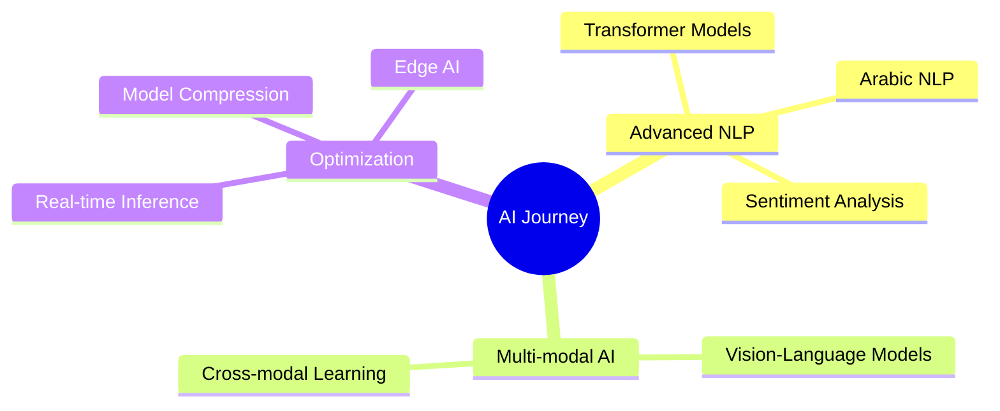

<div align="center">
  
</div>

###

<div align="center">
  <a href="https://linkedin.com/in/hamed-alruwaili" target="_blank">
    
  </a>
  <a href="mailto:hamdb52@gmail.com">
    
  </a>
  <a href="https://github.com/HAMEDB52" target="_blank">
    
  </a>
</div>

###

<div align="center">
  
</div>

###

<h1 align="center">Hi there, I'm Hamed Alruwaili 👋</h1>

###

<h3 align="center">🤖 Data Scientist | AI Engineer | Computer Vision Enthusiast 🚀</h3>

###

<p align="center">
  
</p>

###

<div align="center">
  
  
  
  
  
</div>

###

<br>

## 👨‍💻 About Me

I'm a recent **Computer Science graduate** from Yanbu Industrial College with a passion for transforming complex data into intelligent solutions. I specialize in **deep learning**, **computer vision**, and building AI systems that solve real-world problems.

- 🎓 **GPA:** 3.68/4.0 with Second-Class Honors
- 🌍 Based in **Riyadh, Saudi Arabia** 🇸🇦
- 💼 Former **Data Analyst** at Shaqurdi Technology
- 🧠 Passionate about **AI/ML**, especially Arabic language processing
- 🌐 Bilingual: Fluent in **Arabic** (Native) & **English** (Advanced)

<br>

## 🔭 What I'm Working On

```python
current_focus = {
    "projects": ["Arabic OCR System", "Sign Language Recognition"],
    "learning": ["Advanced NLP", "Multi-modal AI", "Real-time Inference"],
    "goal": "Building impactful AI solutions for Arabic-speaking communities"
}
```

- 🔍 Developing advanced **OCR systems** for Arabic text recognition
- 👋 Building **computer vision** applications for sign language translation
- 🧪 Exploring cutting-edge **deep learning architectures**
- 📊 Contributing to open-source AI/ML projects

<br>

## 🚀 Featured Projects

<div align="center">
  
| Project | Description | Tech Stack |
|---------|-------------|------------|
| [🔤 Arabic Document OCR](https://github.com/HAMEDB52/Optical-Character-Recognition) | Advanced CNN-LSTM OCR system for Arabic text extraction from receipts, invoices, and business cards | Python, TensorFlow, Keras, OpenCV |
| [👋 Sign Language Recognition](https://github.com/HAMEDB52/hand_sign) | Real-time sign language to speech translation using computer vision | Python, CNN, Computer Vision |

</div>

<br>

## 🛠️ Technical Skills

<details open>
<summary><b>🔹 Programming Languages & Frameworks</b></summary>
<br>

<div align="center">
  


</div>
</details>

<details open>
<summary><b>🔹 AI/ML & Deep Learning</b></summary>
<br>

<div align="center">


</div>

**Specializations:**
- 🧠 Deep Learning: CNNs, RNNs, LSTM
- 👁️ Computer Vision: Object Detection, Image Classification, OCR
- 🤖 Machine Learning: Supervised, Unsupervised, Reinforcement Learning

</details>

<br>

## 📚 Continuous Learning & Certifications

<div align="center">

| 🏆 Certification | 🏢 Provider | 📅 Completion Date |
|------------------|-------------|-------------------|
| AI Developer | IBM | Sep 2024 |
| TensorFlow Developer | DeepLearning.AI | Sep 2024 |
| Machine Learning Specialization | DeepLearning.AI | May 2025 |
| Deep Learning Specialization | DeepLearning.AI | Jul 2025 |
| Python 3 Programming | University of Michigan | Mar 2025 |

</div>

<br>

## 🌱 Currently Exploring

<div align="center">



</div>

<br>

## 📊 GitHub Stats

<div align="center">
  
  
</div>

###

<div align="center">
  
</div>

<br>

## 🏆 GitHub Trophies

<div align="center">
  
</div>

<br>

## 📫 Let's Connect!

<div align="center">

**I'm always open to collaborating on innovative AI projects or discussing the latest in machine learning!**

[](https://linkedin.com/in/hamed-alruwaili)
[](mailto:hamdb52@gmail.com)
[](https://github.com/HAMEDB52)

📍 **Location:** Riyadh, Saudi Arabia

</div>

<br>

## 💡 Philosophy

> *"I thrive in technologically advanced environments where I can apply deep learning algorithms to support decision-making and enhance organizational performance. My goal is to contribute to impactful projects that push the boundaries of what's possible with AI."*

<br>

## ⚡ Fun Fact

💬 I'm fluent in both **Arabic** and **English**, which helps me bridge the gap in developing AI solutions for Arabic language processing! This unique advantage allows me to contribute to making AI more accessible for Arabic-speaking communities worldwide. 🌍

<br>

---

<div align="center">
  
  
  **Thank you for visiting my profile! Feel free to reach out for collaborations or just a friendly chat about AI! 🚀**
  
  
</div>
